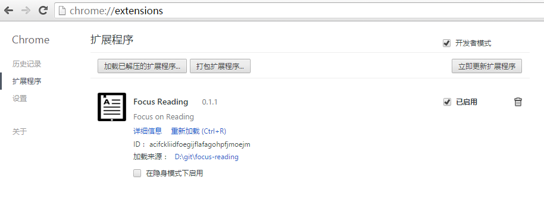

# Focus Reading


## 介绍

Focus Reading（专注阅读），一款 Chrome 插件，帮助你在网站专注浏览文章，排除干扰。

## 支持站点

- http://www.gamersky.com/*
- http://movie.douban.com/*
- http://www.jianshu.com/p/*
- http://baike.baidu.com/*
- http://tieba.baidu.com/p/*
- http://www.zhihu.com/

更多支持站点请查看源码：```src/lib/article-generators/index.js```

## 如何下载？

- 直接在 Github 主要下载源码包：[focus-reading.zip](./archive/master.zip)
- 通过 npm 下载最新版本：```npm install focus-reading```

## 如何使用？

1. 首先，你得有 Chrome 浏览器
2. 然后，在浏览器地址栏输入以下内容并回车：

    ```
    chrome://extensions/
    ```

3. 将 ```extension.crx``` 拖放到页面

4. 加载成功，可以看到 Focus Reading 显示在页面中

    

5. 来到本插件支持的站点，打开一篇文章，点击地址栏中的 Focus Reading 插件图标，进入专注阅读模式

    

## 更新记录

- v0.3.0
    - 替换原有的页面 FR 按钮，改为使用地址栏插件图标进入专注阅读模式
    - 插件改为缺省在所有页面运行，不再于插件配置文件 manifest.json 中进行限制，而是交由程序判断能否在当前页面获取可阅读的内容
- v0.2.0
    - 重构
- v0.1.4
    - 支持 url 中附加查询参数 focus-reading=true 后自动进入专注阅读模式
    - 支持在页面链接中添加“专注阅读”标记，进而打开新页面后直接进入专注阅读模式。