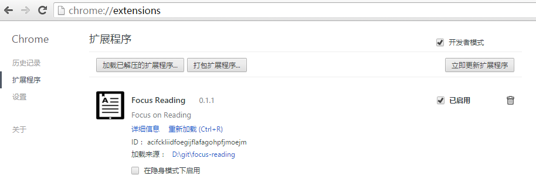

# 介绍

Focus Reading（专注阅读），一款 Chrome 插件，帮助你在网站专注浏览文章，排除干扰。

# 支持站点

- http://www.gamersky.com/*
- http://movie.douban.com/*
- http://www.jianshu.com/p/*
- http://baike.baidu.com/*
- http://tieba.baidu.com/p/*
- http://www.zhihu.com/

更多支持站点请查看 extension/manifest.json 文件中的配置

# 如何使用？

1. 首先，你得有 Chrome 浏览器
2. 然后，在浏览器地址栏输入以下内容并回车：

    ```
    chrome://extensions/
    ```

3. 将 ```extension.crx``` 拖放到页面

4. 加载成功，可以看到 Focus Reading 显示在页面中

    

5. 来到本插件支持的站点，打开一篇文章，此时可以看到页面右上角显示“FR”按钮
6. 点击该按钮，进入专注阅读模式

    

# 其他

- v0.1.4 起，支持 url 中附加查询参数 focus-reading=true 后自动进入专注阅读模式；支持在页面链接中添加“专注阅读”标记，进而打开新页面后直接进入专注阅读模式。